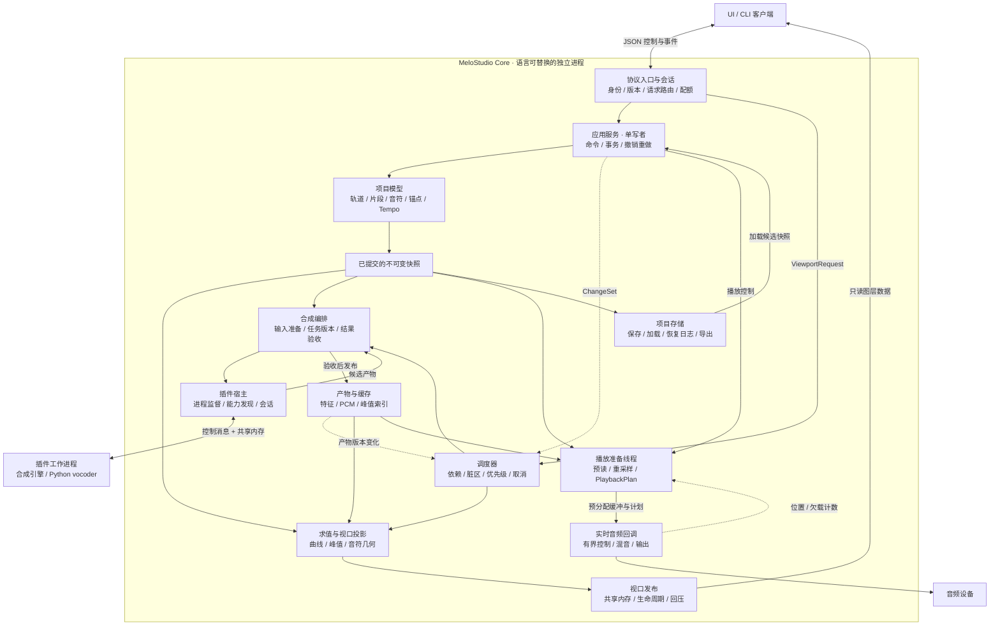

# MeloStudio 核心层架构设计

> 状态：设计提案，尚未实现。基于本目录 v3 文档、架构决策图和仓库现有 `vocoder/sdk` 整理。
> 本文把原图中的“核心进程”展开为模块、线程、数据所有权与实现顺序；保留独立进程与共享协议内核两个前提。
> 现有 `core/` 只有设计资料。下文目录、消息和类型均为拟议结构，不表示已经存在对应代码。

## 1. 总体决定

核心层采用 **语言无关的独立进程模块化架构**：项目状态由一个写入者管理，计算任务读取不可变快照，播放回调消费提前准备好的音频。架构规定可观察行为、模块边界和实时约束，不规定实现语言、运行时或语言内部的数据结构。

可以用 Rust、C++、C#、Go、Zig 或其他语言分别编写核心实现。每个实现都作为完整的 `MeloStudio Core` 出现在协议边界之后，通过同一套一致性测试；客户端在启动或连接时选择实现。这样语言实验不会进入工程文件、UI 或插件契约，也不会要求各实现共享源码。

如果某个实现需要混合语言，跨语言部分应放在明确的适配器或工作进程边界。核心内部是否采用 FFI 属于该实现的工程决定，但不得把语言专用 ABI 暴露为公共协议，也不得让 FFI 阻塞音频回调。

| 问题 | 本提案的选择 |
| --- | --- |
| 谁持有工程真相 | 核心进程的 `ProjectSession`；UI 和插件都不能直接修改项目对象 |
| 谁管理音频设备 | 核心进程的 `AudioEngine`；具体是否使用设备独占模式由设备后端配置决定 |
| 核心怎么启动 | 第一版由 UI 拉起，可用同一可执行文件以 headless 模式启动；不先做常驻守护服务 |
| 如何支持其他客户端 | UI、CLI 和插件复用协议封装，按能力授予不同权限 |
| 如何接现有声码器 | 在独立 Python 工作进程内封装 `vocoder/sdk`，任意核心实现通过插件协议调用 |
| 如何尝试多种语言 | 各语言实现同一核心契约，由一致性测试和基准验证；客户端按实现 ID 启动或连接 |
| 如何保持第一版可控 | 一个核心进程先承载一个已打开项目；允许多客户端连接，编辑写入串行化 |

这里的“三进程”应理解为**三类进程**：一个 UI、一个核心、零到多个插件工作进程。插件可以在不同进程中隔离。

## 2. 核心内部总图

实线表示请求或数据流，虚线表示失效通知与状态反馈；图中模块均位于同一个核心进程内，外部客户端、插件和设备除外。



协议、共享内存、文件系统和音频设备都是外围适配器。领域模型不依赖这些设施，后台算法也不直接发送协议消息。

## 3. 模块职责与依赖

| 模块 | 负责什么 | 主要输入 → 输出 | 边界 |
| --- | --- | --- | --- |
| `domain` | 项目实体、不变量、时间单位、纯编辑规则 | 命令数据与旧状态 → 新状态、变更范围 | 不认识 JSON、线程、设备或 UI |
| `application` | 项目会话、命令校验、事务、历史、运行状态 | 已鉴权命令 → 提交结果、`ChangeSet` | 项目唯一写入入口 |
| `evaluation` | 曲线插值、有效轨判定、时间换算、峰值查询 | 快照、区间、采样密度 → 数值结果 | 不修改项目，不承担任务排队 |
| `presentation` | 可见对象筛选、几何投影、图层装配 | 求值结果、视口描述 → `RenderFrame` | 不包含主题、控件树或 UI 框架 |
| `scheduler` | 结构/值失效合并、任务依赖、取消、预算 | `ChangeSet`、视口、播放需求 → 工作任务 | 任务完成后仍需检查依赖版本 |
| `synthesis` | 输入准备、合成范围、模型选择、产物验收 | 音符/参数或特征快照 → 合成任务、音频产物 | 不把音符直接当作声码器输入 |
| `assets` | 大块不可变数据、内容标识、缓存与驻留预算 | 解码/合成结果 → 特征、PCM、峰值资源 | 项目只保存资源引用，不嵌入大数组 |
| `plugin_host` | 启动/停止/重启插件、能力与参数声明、调用适配 | 引擎端口请求 → IPC 任务与结果 | 插件结果不能绕过应用层改工程 |
| `audio` | 设备流、播放时钟、有界混音与输出 | 准备好的播放计划和音频块 → PCM | 音频回调不运行模型、文件读取或协议处理 |
| `storage` | 工程格式、迁移、资源打包、保存/加载/恢复 | 已提交快照 → 工程文件；文件 → 候选快照 | 加载成功后才在应用层切换项目 |
| `protocol` / `transport` | 消息契约与传输、协商、取消、错误、回压 | 跨进程消息 ↔ 内部请求 | UI 与插件共用框架，业务消息和权限不同 |
| `diagnostics` | trace、指标、任务状态、重放记录 | 请求与状态变化 → 可关联记录 | 实时线程只写预分配记录或计数器 |

应用层定义 `EnginePort`、`ProjectStore`、`AssetStore`、`PlaybackPort` 等所需能力，运行时适配器负责实现。`application` 不反向依赖具体 Python 进程、音频库或磁盘格式。

## 4. 数据模型与所有权

### 4.1 三种状态分开存放

```text
ProjectDocument                         持久化、参与撤销的用户数据
├── ProjectId / schema_version / PPQ
├── TempoMap / MeterMap
├── Tracks[]
│   ├── mixer 参数 / 输出路由 / 引擎绑定
│   └── Parts[]
│       ├── VoicePart: notes / lyrics / 用户音素修正 / automation
│       └── AudioPart: source_id / source_range / timeline_position
└── AssetReferences / PluginBindings

DerivedState                            可重建的计算产物
├── 推导音素与对齐 / 合成参数 / LLSM 等引擎特征
├── 合成 PCM / 波形峰值索引
└── 视口图层 / 任务状态 / 缓存依赖版本

SessionState                            运行时状态，不进入工程撤销栈
├── ClientSession: 选中集 / 编辑手势 / ViewportSubscription
├── TransportState: 播放 / 停止 / 循环 / 位置
└── PluginSessions / 保存进度 / 设备状态
```

用户修改的音素边界属于 `ProjectDocument`；引擎推导的音素边界属于 `DerivedState`。同样，缓存失效、合成完成、播放位置更新都不创建工程撤销记录。

实体采用稳定 ID，删除后不把旧 ID 分配给新对象；撤销可恢复原对象及 ID。UI 命中测试回传 `NoteId` / `AnchorId`，不能使用数组下标作为身份。

### 4.2 时间单位与坐标边界

- 模型区分 `ProjectTick`、`PartLocalTick`、`Seconds`、`SampleFrame`，禁止无单位数字混传。
- 编辑时间使用带明确 PPQ 的定点 tick 表示；视口和插值采样可使用浮点数。转换、舍入规则由核心统一定义。
- 区间统一为半开区间 `[start, end)`。音乐时间到秒由 `TempoMap` 求值；秒到采样帧使用目标资源或设备的采样率。
- UI 持有滚动、缩放、DPI、纵向范围；每次视口请求携带完整快照。核心按该快照生成视口局部几何，UI 负责交互时的坐标反变换、主题和绘制。
- 编排区与钢琴窗可以在**同一客户端**内共享 `TimelineGroupId`。不同客户端可以看不同区域，不强制全局共享一个视口。

工程时间和设备播放时间分别建模。改变 Tempo 会使依赖秒域的合成、峰值查询映射和播放计划失效，但不会改写原始 PCM 样本；移动音频片段默认改变摆放位置，不隐式做时间拉伸。

### 4.3 提交、快照与异步结果

一次工程编辑必须完成以下原子步骤：验证不变量 → 生成事务及逆操作 → 提交状态 → 增加 `ProjectRevision` → 发布快照与 `ChangeSet`。失败时全部不提交；撤销/重做也产生新的单调递增 revision，不把版本号倒回去。

`ChangeSet` 至少描述受影响实体、结构/值变化、旧范围与新范围，以及 Tempo、引擎配置等依赖是否改变。订阅回调只记录失效，读取集中在提交后的调度阶段。

后台任务捕获快照后不读可变工程。每份结果携带 `DependencyStamp`，包含参与计算的片段、参数、Tempo、音频资源、模型等版本。完成时经协调者检查：依赖仍相符才安装产物；无关轨道发生编辑不必丢弃该结果。已经失效的结果可以回收或按完整内容键留作缓存，不能挂到当前工程上。

快照采用按轨道/片段共享的不可变结构，避免每次编辑复制整首工程。旧快照和大块产物在非实时线程回收。

## 5. 线程与调度模型

| 执行上下文 | 执行的工作 | 等待和分配规则 |
| --- | --- | --- |
| 控制 I/O 执行器 | 连接、消息解析、响应、插件监督 | 可异步等待；不在此执行模型推理或长时间数值计算 |
| 项目协调循环 | 单写者事务、会话、任务完成验收 | 每次处理短任务；文件读写和重算移交后台 |
| CPU 工作池 | 曲线、峰值、解码、输入准备、导出 | 可分配；任务分块并检查取消，队列有上限 |
| 插件工作进程 | 模型加载、Python/GPU 推理、插件行为 | 按引擎能力限制并发；阻塞不传染音频回调 |
| 播放准备线程 | 音频预读、重采样、计划构建、旧资源回收 | 提前准备；任何阻塞都不能传入设备回调 |
| 音频设备回调 | 读取已准备块、限量控制、混音、输出 | 不等待、不分配、不释放大型对象、不读写文件、不调用插件 |

“单写者”仅保证工程变更的串行一致性。共享内存同步、队列同步和音频缓冲生命周期仍须分别设计，不能靠“一拍延迟”替代。

调度策略如下：

1. `Structure` 覆盖同一范围内的 `Values`；`Viewport` 是客户端需求变化，不增加工程 revision。
2. 首次变脏排一次刷新，后续合并。只为相交的已订阅视口发失效通知；可见性不限制播放预合成和主动导出任务。
3. 视口请求按 `(ClientSessionId, ViewportId)` 保留最新代；旧任务尽早取消，完成后仍检查版本。
4. 优先保障播放预备，再处理交互视口，最后做后台缓存与导出；各类有并发上限与公平预算，避免导出长期占满工作池。
5. 第一版脏区使用保守范围；后续再实现锚点修改前后分别入账的 ±2 收窄规则。合成失效范围使用引擎声明的上下文，不直接套用曲线插值范围。
6. 拖拽预览默认由 UI 本地绘制，松手提交一个批量事务。以后需要核心预览时，按客户端/手势维护临时状态，不能全局暂停其他客户端或播放调度。

## 6. 协议与数据通道

### 6.1 共用协议内核，区分业务通道

```text
控制连接：有界长度帧 + UTF-8 JSON
  Session     Hello / Welcome / Heartbeat / Goodbye
  Command     Execute / CommandResult / Undo / Redo
  Query       ProjectSnapshot / ViewportRequest / AssetMetadata
  Event       ProjectChanged / DataInvalidated / TaskProgress / TransportState
  Plugin      DescribeCapabilities / OpenSession / Synthesize / CloseSession
  Flow        Cancel / ReleaseBuffer / Error

大数据通道：版本化固定布局的共享内存
  只读块      视口图层、特征、批量产物
  SPSC 环     插件 PCM 传输；仅一生产者、一消费者
```

这些是**同一协议内核中的逻辑消息族**，不增加第三套协议。渲染消息只表达“画什么”；保存、播放、编辑等由独立命令类型表达。

`Hello` 声明协议 major/minor、客户端类型、能力和支持的大数据布局；`Welcome` 返回选定版本、能力、`CoreEpoch` 和新的 `ClientSessionId`。major 不兼容就拒绝，minor 按明确的兼容规则和能力交集工作。文件格式版本、模型版本、共享内存布局版本分别管理。

UI 与插件在消息框架上平权，在权限上不等同。默认合成插件只访问被授予的输入和输出资源；编辑插件提交结构化命令，仍经过权限、revision 和项目规则校验。

桌面首版使用本地 IPC；Windows 可由命名管道与文件映射适配器实现，其他平台使用对应本地连接和共享内存。远程/Web 客户端以后需要二进制流适配器，不能直接读取本地共享内存。

### 6.2 各种编号只负责一件事

| 字段 | 作用与范围 |
| --- | --- |
| `CoreEpoch` | 核心每次启动更新；旧进程的会话、句柄和响应不能沿用 |
| `RequestId` | 关联请求、响应与取消；在一个客户端会话内唯一 |
| `CommandId` | 写命令去重；同一 ID 携带不同内容必须报错 |
| `ExpectedRevision` | 工程写操作的乐观并发条件；不符时返回冲突，由客户端刷新 |
| `ProjectRevision` | 每次成功工程事务后递增；事件按此顺序发布 |
| `DependencyStamp` | 后台任务所依赖的数据版本，用于验收结果和缓存 |
| `Generation` | 每个客户端视口的请求代数；新请求淘汰旧请求 |
| `FrameSequence` | 同一个 Generation 内的渐进结果次序，防止粗结果覆盖细结果 |
| `LayerVersion` | 图层内容身份的一部分，必须与视口/布局/依赖一起判定复用 |
| `BufferId + SlotEpoch` | 一次共享内存槽占用的身份，防止槽重用时读到新内容 |

同一工程的成功事务有全序；不同视口、不同插件任务的结果允许乱序。协议不承诺所有连接之间存在统一的消息到达顺序。

写命令使用与项目绑定的 `CommandId` 查重表：先查是否已提交，再验证 revision。查重结果随恢复日志记录并定义保留窗口；查重信息已过期时返回 `UnknownCommandOutcome`，不能把不确定的重试当作新命令再执行。请求取消若晚于提交，应返回已经提交的结果，不能假装编辑已撤销。

### 6.3 视口契约

原 `ViewportRequest` 补齐客户端、对象范围和纵向映射。以下是语义字段，具体编码在实现协议时固定：

```text
ViewportRequest
  project_id / viewport_id / generation / min_project_revision
  target: arrangement | piano_roll(part_id) | parameter(part_id, key)
  min_tick / max_tick / width_dip / height_dip / device_scale
  vertical: pitch_range | value_range_and_scale | track_layout
  visible_layers / selection_revision

ViewportPayload
  core_epoch / viewport_id / generation / frame_sequence
  project_revision / dependency_stamp / selection_revision
  viewport_echo / is_final / layer_manifest
  layers[]: layer_id / kind / layer_version / buffer_descriptor
```

横向比例由 `width_dip / (max_tick - min_tick)` 推导，避免宽度和缩放互相矛盾。几何以视口局部 DIP 表达，采样密度按物理像素 `ceil(width_dip × device_scale)` 决定；坐标范围与采样数量都要受资源配额限制。

核心生成波形列、连续/分段曲线、Band、LaneSegment 和音符矩形。`NoteId`、有效区间和可选 `IsSelected` 随图层返回；选中态来自该客户端的会话状态，不写入工程，也不使其他客户端缓存失效。UI 可直接绘制即时选中高亮。

数值求值与几何投影分开：曲线缓存可以跨视口共享；投影后的坐标必须以完整视口描述为缓存键。工程里合法重叠的音符不能因“显示去重叠”而被改写，lane 的裁剪规则也不能泛化为所有音符禁止重叠。

每个渐进 payload 都携带**完整图层清单**及每层资源引用，变化层才传新数据，删除层从清单移除。它不是依赖前一帧才能解释的增量补丁。过期帧可直接丢弃，UI 同时按 Generation、FrameSequence、最低数据版本和请求回显校验，之后释放不用的 buffer。

### 6.4 共享内存的发布与回收

跨进程传递的是资源描述符，不是任一语言的对象、引用、智能指针或裸指针：

```text
BufferDescriptor
  resource_id / slot_epoch / layout_version
  byte_offset / byte_length / element_count / stride
  element_format / shape / logical_version
```

布局固定字节序、字段偏移、对齐和浮点表示；使用固定宽度整数并检查长度乘法溢出与区域越界。任何语言的进程内类型都不能自动成为线格式。64 位 ID 在 JSON 中使用十进制字符串，避免部分客户端丢失整数精度。

只读块采用有界槽池，生命周期为 `Free → Writing → Published → Released → Free`。发布前写完内容并执行所需的发布同步；消费者完成读取、且渲染/GPU 不再使用该内存后发 `ReleaseBuffer`。所有持有者释放后才能重用槽并增加 SlotEpoch。

每个客户端有独立的持有记录。**双缓冲加序号本身不能阻止覆盖仍在读取的数据。** 槽不足时合并尚未发布的旧视口任务，不能覆盖已发布槽。慢客户端达到配额后停止给它发布大块数据；连接失效时撤销访问，但其旧映射仍可能存在，必须隔离保留或销毁原资源，不能立刻把那块物理内存重用给新会话。

共享 PCM 环由双方协商采样率、通道数、float32 格式、容量和布局。生产者发布写游标，消费者确认读取后推进读游标；满环时后台生产者等待/取消，不能覆盖未读音频。跨进程原子操作及内存可见性必须由各目标平台和语言桥接层验证，不能假设普通字段赋值已经安全。

视口响应可以丢旧留新，项目变更和命令结果不能静默丢弃。慢客户端若失去可靠事件连续性，应收到重同步要求或断开后重新获取快照；队列容量与每连接配额必须显式设置。

JSON 控制消息不包含 NaN/Infinity。曲线断点 NaN 只允许出现在已声明的二进制曲线布局里，声明数据用明确的缺省/分段标记表达；音频和模型特征必须全部有限。

## 7. 三条关键执行路径

### 7.1 编辑一根参数曲线

```text
UI 本地拖拽预览
  → Execute(BatchEditAnchors, CommandId, ExpectedRevision)
  → 权限、去重、revision 与值域检查
  → 应用层提交一个事务和一个撤销项
  → ProjectChanged + ChangeSet
  → 调度器合并结构/值失效，标记受影响合成产物
  → 向相交的视口订阅发 DataInvalidated
  → UI 请求新 Generation，核心读取已提交快照求值
  → 发布图层；UI 校验后替换并释放旧资源
```

UI 本地预览可以即时响应，但提交结果决定最终值。并发冲突时返回当前 revision 与冲突信息，第一版不静默合并两位用户对同一个对象的写入；客户端刷新后由用户动作重新产生命令。

### 7.2 合成与播放

```text
播放位置附近缺少当前版本 PCM
  → scheduler 创建带 DependencyStamp 的合成任务
  → synthesis 准备引擎输入，plugin_host 发起任务
  → 插件在共享内存中交付带任务/片段/样本范围的音频
  → 非实时消费者检查格式、长度、有限值及任务版本
  → 通过验收后安装不可变 AudioArtifact，并触发波形失效
  → 播放准备线程预读、做采样率/通道适配，构建 PlaybackPlan
  → 音频回调从核心自身预分配缓冲读取、混音并输出
```

插件共享内存环的消费者是**非实时音频接收线程**。设备回调不直接依赖插件的写游标推进，插件即使超时或崩溃也不能卡住它。为保证这个隔离，允许从插件共享内存复制到核心拥有的预分配音频缓冲；“不序列化 PCM”不等于“整条链路绝不复制”。

`PlaybackPlan` 在回调外编译，包含已准备的音频块引用、采样区间、路由及必要的参数表。资源预算限制最大活动轨数、图节点数和每回调控制消息数；计划替换发生在音频块边界，旧计划退回非实时线程回收。回收队列满时延迟换计划，不能在回调中释放大对象。

播放命令分成“已接受”和“已应用于音频块”两种状态；音频回调是实际播放采样位置的来源。UI 收到位置和时间戳后可以自行平滑游标，不必每个显示帧都请求重算波形。

Seek、循环边界或计划切换带新的 `TransportGeneration`，缓冲中的旧代块不得继续播放。欠载时对缺失部分短淡出到静音并记录计数，恢复时淡入；不能阻塞等待，也不能默认播放已被编辑判定失效的旧合成片段。导出遇到缺失产物则等待、失败或由用户取消，不能把实时欠载的静音策略用于正式文件。

第一版只支持后台/预先合成引擎。未来若增加实时效果插件，需另行定义延迟补偿、块截止时间和旁路策略；不能仅因为使用共享内存环就宣称支持硬实时插件。

### 7.3 保存、加载与恢复

保存捕获一个已提交 revision 的快照，由存储线程写临时工程文件并完成资源清单和完整性检查，成功后使用平台适配的原子替换方式发布。若写入期间又发生编辑，只把捕获的 revision 标记为已保存，当前项目继续保持 dirty。

工程包保存用户文档、资源清单和必要的源音频；可再生缓存单独管理。缺失插件的参数和绑定按不透明数据保留，打开项目时标记能力不可用，不丢弃用户内容。加载、迁移、资源核验在后台完成，再通过协调循环整体切换；加载失败保留原项目。

恢复日志记录有序的已提交事务、CommandId 与结果摘要，带校验和及完整记录边界，并定期合并为检查点。命令响应区分 `committed_revision` 与 `durable_revision`：内存里提交成功不等于已经落盘。异常退出后只承诺恢复到最后一个完整持久化记录，客户端必须重新握手、读取快照并核对未确认命令，不能沿用旧 epoch 的缓存。

导出绑定固定项目快照与渲染配置，后台逐段等待相符版本的产物，经过同一套混音语义写文件；用户可以同时继续编辑，但这些新编辑不会混入正在导出的文件。

## 8. 现有 vocoder 的接入方式

仓库根目录的 `core/` 是编辑器核心；[`vocoder/core/`](../../vocoder/core/) 是声码器神经网络实现，两者不能因名称相同而合并。训练、预处理、PyTorch/GPU 状态继续留在声码器项目内。

### 8.1 现有能力与缺口

| 代码依据 | 已有能力 | 接入时新增的工作 |
| --- | --- | --- |
| [`sdk/types.py`](../../vocoder/sdk/types.py) | `LLSMFeatures`、`DSPControl`、`SynthesisRequest`、`AudioResult` | 共享内存格式与 Python 类型的转换、缓冲所有权约束 |
| [`sdk/session.py`](../../vocoder/sdk/session.py) | 加载模型并复用会话，普通/分块合成、音频分析入口 | 工作进程封装、任务协议、进度、取消与异常映射 |
| [`core/config.py`](../../vocoder/core/config.py) | 默认 48 kHz、hop=256，配置携带模型参数 | 启动时读取真实 checkpoint 能力，不把默认值写死在核心 |
| [`sdk/session.py`](../../vocoder/sdk/session.py) 的 `synthesize_chunked` | 重叠分块计算后返回整段 `AudioResult` | 第一版按整段结果交付；真正逐块流式输出需要扩展 SDK |

建议先新增一个受宿主管理的 Python 适配进程，调用 `VocoderSession.from_checkpoint()` 后复用模型，不把 Python 运行时嵌入任何一个核心实现。Python 共享环不能靠普通 NumPy 字段赋值实现同步，需经验证的原生桥接或通道库；模型输入输出适配可以有拷贝，不承诺当前 SDK 是零拷贝接口。

### 8.2 引擎输入链

```text
音符 / 歌词 / 用户参数
  → 音素与时长处理
  → 声学模型或特征生成器                 当前仓库尚无完整的音符到 LLSM 实现
  → 版本化声学特征，例如 LLSM72
  → vocoder 插件
  → PCM AudioArtifact

现阶段可独立跑通的链：
已有 LLSM 特征 → vocoder → PCM
已有音频 → SDK 分析入口 → LLSM → vocoder → PCM
```

声码器适配的请求包含 `TaskId`、输入依赖版本、特征资源、帧范围、checkpoint 内容标识、seed、DSP 控制和分块设置。LLSM72 在通道中明确约定为 float32 `[T, 72]`，桥接时校验维度和方向，不凭某一维等于 72 猜布局；`T=72` 的方阵也是边界验收用例。

特征采样率、hop、来源采样率和版本分别传递；默认单声道输出长度为 `T × checkpoint.hop_length`，实际采样率读取 checkpoint。播放设备若使用其他采样率，由播放准备阶段显式重采样。

SDK 的 DSP 控制属于合成输入，会改变产物缓存键；播放器的轨道音量属于混音参数，不自动重复施加同一 DSP 增益。音素/声学引擎可以输出专用特征，通用 `domain` 只保存能力标识与资源引用，不把 LLSM72 固化为所有插件的唯一格式。

现有 SDK 没有任务中途取消接口：取消先阻止排队与结果安装，运行中的调用返回后丢弃结果；超时可由宿主终止工作进程并使该进程中的所有任务失败。若以后扩展逐块输出，必须一起定义重叠区提交时机、上下文、随机种子与分块边界一致性，不能把当前函数直接视为流式接口。

缓存键至少包含输入内容、模型内容标识、引擎/算法版本、seed、DSP 参数和分块设置。对于不能保证跨硬件位级确定性的模型，trace 重放使用已记录产物或声明数值容差，不承诺重新推理能逐位复现。

## 9. 生命周期、错误与观测

启动顺序为：创建 CoreEpoch 和本地受限端点 → 初始化资源预算、工作池与项目会话 → 对客户端报告 Ready → 按需打开设备和插件。UI 持有启动所有权令牌，其他客户端只附着；关闭 UI 时先完成关闭会话流程，而非直接杀掉核心。headless 模式由启动者负责关闭，常驻模式后续再增加。

插件状态机为 `Discovered → Starting → Ready → Busy → Stopping → Exited/Failed`。崩溃或超时只使关联会话和任务失败；退避重启要设次数上限，模型重载后使用新会话 ID，旧响应不能安装。核心与 UI 断连时 UI 保留最后画面并显示断开状态，重连需完整握手和状态同步。

核心关闭时停止接收新编辑，完成已承诺的保存/持久化操作，停止音频流，再取消后台工作、关闭插件、回收资源。停止设备回调是释放其音频计划和缓冲的前提。

错误帧包含 `code / request_id / task_id / retryable / current_revision / message`，区分 `ValidationError`、`Conflict`、`UnsupportedCapability`、`ProtocolError`、`Cancelled`、`PluginCrashed`、`ResourceExhausted` 和 `IoError`。客户端可以显示错误，但不得根据 `retryable` 自动重放非幂等编辑。

每个任务关联请求 ID、项目 revision、依赖版本和插件会话；trace 记录命令、提交顺序、任务状态、取消原因、视口版本与 buffer 生命周期。大数据记录内容摘要及可选本地资源引用，不把整段 PCM 塞入 JSON 日志。

重放分为：命令重放验证项目状态；协议重放验证乱序/断连/句柄处理；产物回放隔离模型非确定性。真实音频截止时间仍需设备和负载测试，不能用事件重放替代。

## 10. 多语言实现组织建议

规范、测试夹具与具体实现分开存放。模块名表达逻辑职责，不映射到某种语言特有的包机制：

```text
core/
├── spec/                              实现无关的契约源
│   ├── protocol/                      JSON schema / 二进制布局 / 版本规则
│   ├── project-format/                工程格式与迁移规则
│   └── semantics/                     时间、插值、撤销、调度语义
├── conformance/                       所有实现必须运行的黑盒测试
│   ├── fixtures/                      输入工程、命令流、期望摘要
│   ├── protocol/                      握手、乱序、取消、回压、坏帧
│   ├── project/                       命令、撤销、保存往返
│   ├── render/                        曲线、音符、峰值黄金数据
│   ├── audio/                         混音、seek、欠载与格式测试
│   └── runner/                        启动任意核心可执行文件并验收
├── implementations/
│   ├── rust/                          可选实现；有需要时创建
│   ├── cpp/                           可选实现；有需要时创建
│   ├── csharp/                        可选实现；有需要时创建
│   └── <language>/                    其他实验实现
├── benchmarks/                        同一工程、操作脚本和测量口径
└── docs/

plugins/nhn-vocoder-worker/             后续新增；核心目录之外的 Python 适配器
vocoder/                               保留现有训练、推理与 SDK 工程
```

每个语言目录都实现第 3 节的逻辑模块：`domain`、`application`、`evaluation`、`presentation`、`scheduler`、`synthesis`、`assets`、`audio` 和外围适配器。目录与包的具体拆法由语言实现自行决定，但依赖方向和公共行为必须一致。

所有实现向 `conformance/runner` 暴露相同的启动参数和探测命令，例如 `--endpoint`、`--data-dir`、`--headless`、`--implementation-info`。`Hello/Welcome` 中增加 `implementation_id`、`implementation_version` 与可选能力；这些字段用于诊断和选择，不改变工程语义。

协议 schema、二进制布局和测试向量是规范源，不能从某个实现的类或结构体反向生成唯一真相。允许由规范生成各语言 DTO 和编解码代码，生成物不可承载领域行为。

跨实现验收分三层：

1. **协议一致**：相同输入帧得到相同状态码、版本推进和资源生命周期。
2. **语义一致**：命令流结束后的规范化项目摘要、撤销结果、曲线采样和混音结果相同；浮点结果使用明确容差。
3. **性能与实时性独立达标**：每个实现分别报告延迟、内存、回调截止时间和欠载，不能用另一语言实现的成绩代替。

多个实现可以同时存在，但同一已打开项目只由一个核心进程持有写权限。切换语言实现时先保存并关闭原核心，再由新核心加载工程并运行迁移/一致性检查；不在两个核心之间共享可变内存，也不做双主写入。

## 11. 分阶段实现与验收

| 阶段 | 实现内容 | 完成标准 |
| --- | --- | --- |
| P0：领域与命令闭环 | 项目实体、时间换算、批量事务、撤销重做、快照 | 编辑/撤销/重做满足不变量；失败事务不留下部分修改 |
| P1：独立核心最小闭环 | 规范源、一致性 runner、本地握手、一个音符视口、槽生命周期、trace | 第一种语言实现通过黑盒套件；客户端请求并读取图层；读取中的槽不被复用 |
| P2：完整编辑读模型 | 参数曲线、音频峰值、两级失效、视口订阅、保存加载 | 编辑后视口更新正确；项目保存往返一致；双客户端写冲突可见 |
| P3：第二语言对照 | 用第二种语言实现 P0–P2，并修正规范中的隐含假设 | 两个实现通过同一黑盒套件，工程可互相保存和加载，差异均有明确记录 |
| P4：可听闭环 | 播放准备、设备回调、模拟插件、Python vocoder 适配 | 已有 LLSM 能得到 PCM 并播放；插件阻塞/退出不会阻塞设备回调 |
| P5：优化与恢复 | 峰值金字塔、脏区收窄、缓存预算、日志恢复、离线导出 | 长工程查询避免随总样本数线性扫描；结果与基准一致；重连和恢复不重复编辑 |

取消、回压、资源释放与协议版本校验在 P1 就必须有最小可用实现，不能只定义消息后留空。波形金字塔和精确脏区可以在保守实现正确后再加入。

验证重点应放在真实边界：乱序与取消竞争、多客户端 buffer 持有、插件崩溃、Seek 后旧音频、保存期间继续编辑、Tempo 改动、模型输出维度/采样率、资源预算耗尽。单元算法以朴素实现做对照，尤其验证峰值极值没有丢失、插值收窄不漏脏区。

性能目标以测量作为验收依据：交互绘制面向 60 fps；视口数据规模随可见像素和可见对象数量增长；已缓存数据的跨进程发布先以 p95 < 1 ms 为目标。音频预算为 `block_frames / sample_rate`，例如 48 kHz、256 帧约 5.33 ms；记录回调耗时分位数、最大耗时与 underrun，而不只看平均 RTF。以上均是待验证目标，不是现有仓库性能承诺。

## 12. 对原 v3 文档的澄清与修正

原文和原图继续保留为决策背景。下面是本提案对实现语义的修正；实施本提案时应同时更新对应协议示例，不能混用两种定义。

| 原资料中的表述 | 本提案采用的语义 |
| --- | --- |
| 核心独立进程，但结尾又建议同进程起步 | 沿用已确认的独立进程约束；测试可以进程内调用领域层，生产入口仍走独立核心 |
| 协议只传“画什么”，又包含播放/保存 | 约束适用于渲染消息族；共用协议内核同时承载命令、查询和事件 |
| 坐标换算全留 UI，又要求核心算完 Y/音符缝 | UI 提供完整视口，核心 presentation 生成 DIP 几何；UI 保留交互反变换与显示状态 |
| `DataHandle<T>(T Value, Version)` 或换引用即可跨进程 | 概念性对象不能上线；使用资源描述符、版本与显式释放，进程内引用不跨边界 |
| 双缓冲加序号即可保护读者 | 发布槽在所有读者释放前不可覆写；序号只能辨识版本，不能代替所有权 |
| 插件合成和 CreateSession 可以在音频线程执行 | 本仓声码器属于后台合成；会话建立、推理与 IPC 全在非实时上下文 |
| 所有视图共享同一 TickAxis | 同客户端的关联视图共享时间轴；不同客户端独立持有视口 |
| 拖动时用全局 Suspended 抑制刷新 | 默认本地预览、一次提交；未来核心预览只影响对应手势，不能冻结其他工作 |
| 30 KB/帧使 JSON 必然撑不住、跨进程慢约 10 倍 | 这些数字缺少本仓基准，不能作硬结论；仍选择共享内存控制大数组序列化与分配开销 |
| 核心首选 Rust / 高性能语言 | 当前规范不限定语言；每种实现以相同语义、协议和实时验收为准 |
| 无 GC 因而可以保证硬实时 | 无 GC 只排除一种停顿来源；有 GC 的实现要用预分配、池化或非托管缓冲，所有实现都须约束分配、析构、锁、缺页和设备调度 |

原渲染文档的波形密度公式还需要按单位修正。对于 BPM 恒定片段，`samples_per_pixel = sample_rate / (ticks_per_second × pixels_per_tick)`，其中 `ticks_per_second = PPQ × BPM / 60`；遇到 Tempo 变化则通过时间映射求每个像素列的样本区间。

峰值层级选择应使用不粗于所需样本跨度的合适级别，并通过边界细化保证该像素区间的极值；高度放大时允许核心读取原始样本，仍只向 UI 返回当前所需数据。原始样本不全量跨边界与核心内部不准读样本是两件不同的事。冷缓存构建有独立成本，查询也包含索引查找和可见对象数，不能把“与总时长无关”解释为任何情况下都固定耗时。

## 13. 依据

- [`v3-architecture-decision.md`](v3-architecture-decision.md)：进程边界、语言与协议内核的决策背景。
- [`v3-render-protocol-design.md`](v3-render-protocol-design.md)：视口、图层、脏区与版本机制的初稿。
- [`v3-架构决策图.png`](v3-架构决策图.png)：本次展开的三类进程和核心引擎划分。
- [`vocoder/sdk/types.py`](../../vocoder/sdk/types.py)、[`vocoder/sdk/session.py`](../../vocoder/sdk/session.py)、[`vocoder/core/config.py`](../../vocoder/core/config.py)：本次核对过的现有声码器接口。

原资料引用的 TuneLab 代码和桌面 `架构v3.pdf` 不在本仓，本文没有将这些引用当作重新验证过的实现或性能证据。
